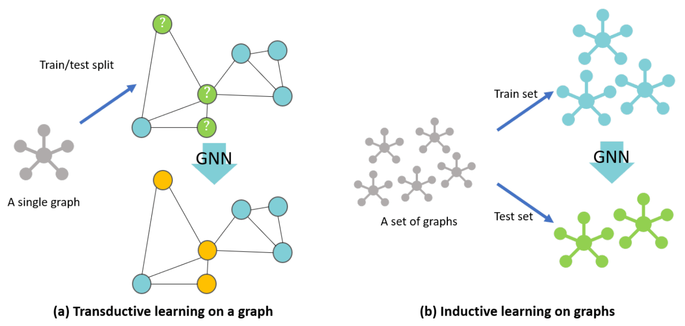
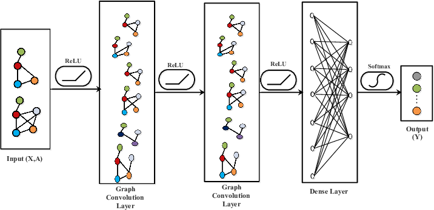

## Model Directory Structure

The repository is organized as follows:

- **models/**
  - `GNN_Generic.ipynb`: A generic Graph Neural Network model for the project.

- **clustering/**
    - `City_plots/Plotting_the_cities.ipynb`: This contains our initial approach that is by plotting the amenities on a map and applying various clustering techniques to predict the metro stations.

- **model_test/**
  - `GNN_aryan_25Quantile.ipynb`: A GNN/GCN model variant setting the nodes ouput to 1 for a predicted metro station on the basis of a percent quantile that is the population is more than 25% than the average population.
  - `GNN_aryan.ipynb`: Customized GNN/GCN model by Aryan.
  - `GNN_chetan.ipynb`: Customized GNN/GCN and the first GCN model by Chetan.
  - `GNN_Generic.ipynb`: Another instance of the generic GNN/GCN model.
  - `GNN_Kirtiraj.ipynb`: Customized GNN/GCN model by Kirtiraj.
  - `GNN_MayankPatel.ipynb`: Customized GNN/GCN model by Mayank Patel.
  - `updated_data.csv`: Updated dataset used for modeling and predictions.

- **README.md**: This file provides an overview of the project and folder structure.

## About the model

## Graph Convolutional Networks (GCNs)

### What is a GCN?
Graph Convolutional Networks (GCNs) are specialized neural networks that operate on graph-structured data, capturing dependencies between nodes connected by edges. Unlike traditional neural networks that handle grid-like data, GCNs aggregate information from a node's neighbors, allowing for rich representations of node features within a graph structure.

### Implementation in This Project

1. **Graph Construction**:
   The graph is constructed using geographic and demographic data, where:
   - **Nodes** represent data points (potential metro station locations) with features like latitude, longitude, and population and one hot encoded values of suburb,road and district.
   - **Edges** connect nodes based on geographic proximity and have weights determined by population differences.

2. **GCN Model Architecture**:
   - The model consists of 10 layers of GCN convolution. Each layer aggregates features from neighboring nodes and applies transformations using ReLU activation.
   - The final output layer uses a sigmoid activation function for binary classification, predicting whether a node represents a potential metro station.

### Visual Illustrations

1. **Graph Construction Illustration**  
   

2. **GCN Architecture Diagram**  
   

### One-Hot Encoding

**One-Hot Encoding** is a technique used to convert categorical data into a numerical form that machine learning models can understand. It transforms each unique category value into a binary column, ensuring that no ordinal relationship is introduced between different categories.

#### Example:
For a column with values `Red`, `Green`, and `Blue`, One-Hot Encoding would create:

| Color   | Color_Red | Color_Green | Color_Blue |
|---------|-----------|-------------|------------|
| Red     | 1         | 0           | 0          |
| Blue    | 0         | 0           | 1          |
| Green   | 0         | 1           | 0          |

#### Usage in This Project:
In this project, One-Hot Encoding is applied to categorical features before building the graph. This allows the Graph Convolutional Network (GCN) model to effectively utilize these features such as road name, suburb name and district name alongside numerical attributes like latitude, longitude, and population.
