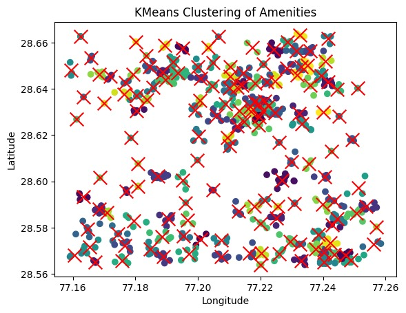

# Graph Convolutional Network (GCN) for Node Classification

This project implements a Graph Convolutional Network (GCN) using PyTorch and PyTorch Geometric for node classification. The GCN takes node features and graph structure as input, processes them through multiple graph convolutional layers, and predicts node labels. 


 

## Files and Structure
1. **main.py**: Core Python script containing the GCN model, data preprocessing, training, and evaluation functions.

2. **edge_embedding.csv**: 
   - Contains the *edge embedding*, representing spatial relationships between nodes.
   - Each row corresponds to the difference in geographical coordinates of two connected points: [latitude1−latitude2, longitude1−longitude2]
   - Three columns: node1, node2, and embedding containing the geographical coordinate differences between nodes.

3. **centroid.csv**:
   - Contains centroids generated through *KMeans clustering* to divide the city into 150 clusters.
   - These centroids represent nodes in the graph, with their *Node IDs* included.

4. **node_embedding.csv**:
   - Provides features associated with each cluster centroid.
   - Columns include:
     - *Node ID*: Unique identifier for each node.
     - *Centroid Latitude* and *Centroid Longitude*.
     - *Total Amenities* and *Number of Amenities*: Aggregated counts for all categories.
     - Features such as the count of specific amenities:
       - bar, cafe, fast_food, food_court, ice_cream, pub, restaurant
       - Educational amenities like college
   - This embedding is used as input features for the GCN.

5. **node_embedding_binary_label.csv**: CSV file containing node embeddings with features and binary labels (label_binary column for classification).
    - Includes features like total_amenities, Num_Amenities, Centroid_Latitude, Centroid_Longitude, and specific amenity counts (bar, cafe, restaurant, etc.).

6. **predictions.csv**: Output CSV file generated after training, containing node IDs and predicted classes.

---

## Setup and Dependencies

### Install Required Packages

Make sure you have Python 3.7+ installed. Use the following commands to install the required dependencies:


```bash
pip install torch torchvision torchaudio
pip install torch-geometric
pip install scikit-learn pandas numpy
```

### Files Required

- node_embedding_binary_label.csv: Ensure this file contains:
  - A column named node_id for node identifiers.
  - Features columns like total_amenities, Num_Amenities, and other amenity-based features.
  - A label_binary column containing the binary labels for classification.
- edge_embedding.csv: Ensure this file contains:
  - Three columns: node1, node2, and embedding.
  - Embedding values representing geographical coordinate differences.
- centroid.csv: Contains KMeans clustering results.
- node_embedding.csv: Contains feature vectors for each node.

---

## Running the Code

1. Place the required CSV files in the appropriate directory.
2. Run the script:

```bash
python main.py
```

### Outputs

- *Console Output*:
  - Training progress with loss and accuracy for both training and validation sets.
  - Test accuracy after evaluation.
- **predictions.csv**:
  - Contains two columns:
    - node_id: Original node ID from the dataset.
    - predicted_class: Predicted class labels.

---

## Explanation of Functions

### 1. *Model Architecture*

The GCN class defines a 3-layer graph convolutional network with batch normalization and dropout for regularization.

### 2. *Data Loading and Preparation*

- load_and_prepare_data(nodes_path, edges_path):
  - Loads node and edge CSV files.
  - Maps node IDs to internal indices.
  - Prepares node features and labels, and creates a torch_geometric.data.Data object.

### 3. *Train/Validation/Test Splits*

- create_train_val_test_masks(data, train_size=0.5, val_size=0.45):
  - Splits the nodes into train, validation, and test sets.
  - Adds corresponding boolean masks to the Data object.

### 4. *Training*

- train_model(model, data, epochs=50, lr=0.001):
  - Trains the GCN on the training set using Adam optimizer.
  - Prints the loss and accuracy for train and validation sets during training.

### 5. *Evaluation*

- evaluate_model(model, data):
  - Evaluates the model on the test set.
  - Returns test accuracy and a classification report.

---

## Customization Options

1. *Hyperparameters*:
   - Adjust hidden_dim, epochs, and learning rate in the train_model function.
2. *Node Features*:
   - Add or modify features in the node_embedding_binary_label.csv file.
3. *Graph Structure*:
   - Update edge_embedding.csv to represent a different graph topology.

---

## Example Data Format

### Node File: node_embedding_binary_label.csv

| node_id | total_amenities | Num_Amenities | Centroid_Latitude | Centroid_Longitude | bar | cafe | restaurant | ... | label_binary |
|---------|------------------|---------------|-------------------|--------------------|-----|------|------------|-----|--------------|
| 1       | 10               | 5             | 37.7749           | -122.4194          | 2   | 1    | 2          | ... | 1            |
| 2       | 20               | 10            | 40.7128           | -74.0060           | 5   | 3    | 2          | ... | 0            |

### Edge File: edge_embedding.csv

| node1 | node2 | embedding |
|-------|-------|-----------|
| 1 | 79 | [-0.00106982, -0.00244334] |
| 1 | 135 | [0.00264242, -0.00221054] |

Note: The embedding column represents the geographical coordinate differences [latitude1−latitude2, longitude1−longitude2] between connected nodes.

### Centroid File: centroid.csv

| node_id | latitude | longitude |
|---------|----------|-----------|
| 1       | 37.7749  | -122.4194 |
| 2       | 40.7128  | -74.0060  |

### Node Embedding File: node_embedding.csv

| node_id | Centroid_Latitude | Centroid_Longitude | total_amenities | Num_Amenities | bar | cafe | fast_food | food_court | ice_cream | pub | restaurant | college |
|---------|-------------------|-------------------|-----------------|---------------|-----|------|-----------|------------|-----------|-----|------------|----------|
| 1       | 37.7749           | -122.4194         | 15              | 8             | 2   | 1    | 1         | 0          | 1         | 1   | 2          | 0        |
| 2       | 40.7128           | -74.0060          | 25              | 12            | 5   | 3    | 2         | 1          | 0         | 2   | 4          | 1        |

---

## Notes

- The node embeddings should contain meaningful features to allow the GCN to learn effectively.
- Ensure that all `node_id`s in the edge file exist in the node file.
- The labels in label_binary should be 0 or 1 for binary classification.
- The centroids file is generated using KMeans clustering to divide the city into 150 distinct areas.
- Edge embeddings represent geographical relationships between connected nodes.

---