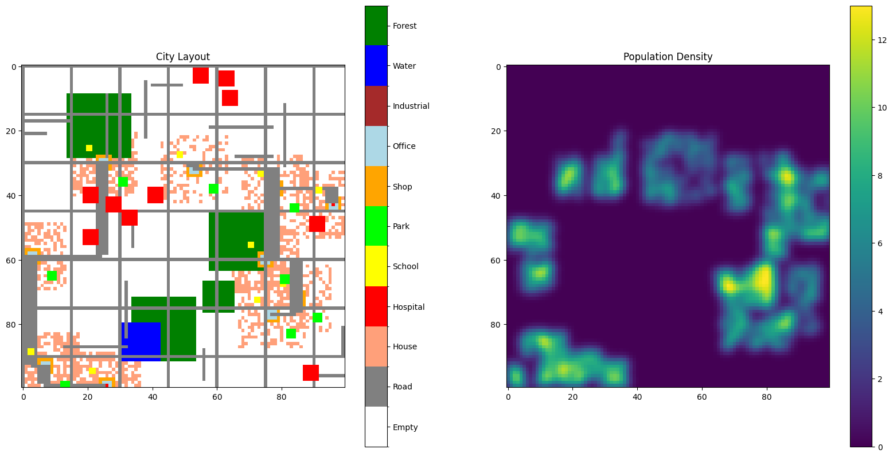

# DummyCity Simulation

## Project Overview

The **DummyCity** project is a Python-based simulation that creates a city grid, placing various facilities, roads, and terrain features. The city model includes realistic elements such as houses, hospitals, schools, parks, water bodies, forests, and different road types. Additionally, it computes and visualizes population density around the activity centers in the city.

## Features

- **City Grid:** A 2D grid representation of a city where each cell is categorized as one of the following: road, house, hospital, school, park, shop, office, industrial, water, or forest.
- **Activity Centers:** Key points in the city (e.g., hospitals, offices, shops) around which facilities and roads are built.
- **Terrain Generation:** Randomly places water bodies and forests in the city.
- **Road Network:** Implements a primary road network using the minimum spanning tree (MST) algorithm and adds secondary and tertiary roads to complete the infrastructure.
- **Facilities and Population:** Adds facilities (e.g., hospitals, schools) near activity centers and calculates population density around them.
- **Visualization:** Provides a visual representation of the city layout and its population density using Matplotlib.

## Installation

### Prerequisites

- Python 3.x
- Required libraries: `numpy`, `matplotlib`, `networkx`

You can install the required libraries via pip:

```bash
pip install numpy matplotlib networkx
```

### Files

- `dummy_city.py`: The main script containing the city simulation code.
- `city_output.png`: Example output image visualizing the city layout and population density (add your output image here).

## How to Run

1. Clone this repository or download the project files.
2. Run the script:

```bash
python dummy_city.py
```

This will generate the city grid, build the facilities and roads, calculate population density, and display the results.

## Code Structure

- **`DummyCity` Class:** Handles the generation and management of the city grid, including the placement of activity centers, roads, terrain, and facilities.
  
  - `add_activity_centers()`: Places key activity centers like hospitals, shops, and offices.
  - `add_terrain()`: Randomly adds water bodies and forests.
  - `add_roads()`: Creates primary, secondary, and tertiary roads to connect activity centers.
  - `connect_points()`: Lays down roads between specific points (activity centers).
  - `add_facilities()`: Adds houses, hospitals, schools, and parks around activity centers.
  - `update_population_density()`: Computes the population density in the area around a facility.
  - `visualize()`: Visualizes the city layout and population density using Matplotlib.

## Example Output

Below is an example output generated by the simulation:



- **Left Image:** Represents the city layout, where each color corresponds to different facilities and terrains.
- **Right Image:** Displays the population density across the city, with darker regions representing higher density.
